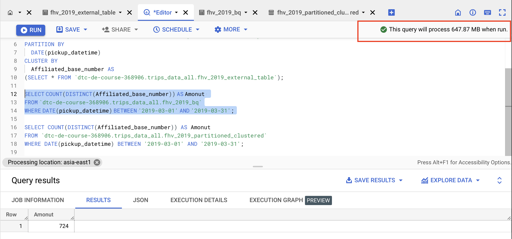

## Week 3 Homework
source: https://github.com/DataTalksClub/data-engineering-zoomcamp/blob/main/cohorts/2023/week_3_data_warehouse/homework.md#submitting-the-solutions

## Question 1:
What is the count for fhv vehicle records for year 2019?
- 65,623,481
- **_43,244,696_**
- 22,978,333
- 13,942,414
  
  
  
## Question 2:
Write a query to count the distinct number of affiliated_base_number for the entire dataset on both the tables.  
What is the estimated amount of data that will be read when this query is executed on the External Table and the Table?

- 25.2 MB for the External Table and 100.87MB for the BQ Table
- 225.82 MB for the External Table and 47.60MB for the BQ Table
- 0 MB for the External Table and 0MB for the BQ Table
- **_0 MB for the External Table and 317.94MB for the BQ Table_**
  
  
  
  
Why it shows 0 MB for the external Table, the reason is shown in [BigQuery Guides](https://cloud.google.com/bigquery/docs/external-tables)  
> A dry run of a federated query that uses an external table might report a lower bound of 0 bytes of data, even if rows are returned. This is because the amount of data processed from the external table can't be determined until the actual query completes. Running the federated query incurs a cost for processing this data.
  
## Question 3:
How many records have both a blank (null) PUlocationID and DOlocationID in the entire dataset?
- **_717,748_**
- 1,215,687
- 5
- 20,332
  
  
  
## Question 4:
What is the best strategy to optimize the table if query always filter by pickup_datetime and order by affiliated_base_number?
- Cluster on pickup_datetime Cluster on affiliated_base_number
- **_Partition by pickup_datetime Cluster on affiliated_base_number_**
- Partition by pickup_datetime Partition by affiliated_base_number
- Partition by affiliated_base_number Cluster on pickup_datetime
  
## Question 5:
Implement the optimized solution you chose for question 4. Write a query to retrieve the distinct affiliated_base_number between pickup_datetime 03/01/2019 and 03/31/2019 (inclusive).  
Use the BQ table you created earlier in your from clause and note the estimated bytes. Now change the table in the from clause to the partitioned table you created for question 4 and note the estimated bytes processed. What are these values? Choose the answer which most closely matches.
- 12.82 MB for non-partitioned table and 647.87 MB for the partitioned table
- **_647.87 MB for non-partitioned table and 23.06 MB for the partitioned table_**
- 582.63 MB for non-partitioned table and 0 MB for the partitioned table
- 646.25 MB for non-partitioned table and 646.25 MB for the partitioned table
  
  
  

## Question 6: 
Where is the data stored in the External Table you created?

- Big Query
- **_GCP Bucket_**
- Container Registry
- Big Table

## Question 7:
It is best practice in Big Query to always cluster your data:
- True
- **_False_**

The first step should be `partition by`, and then you can consider if use `clutered by`.
