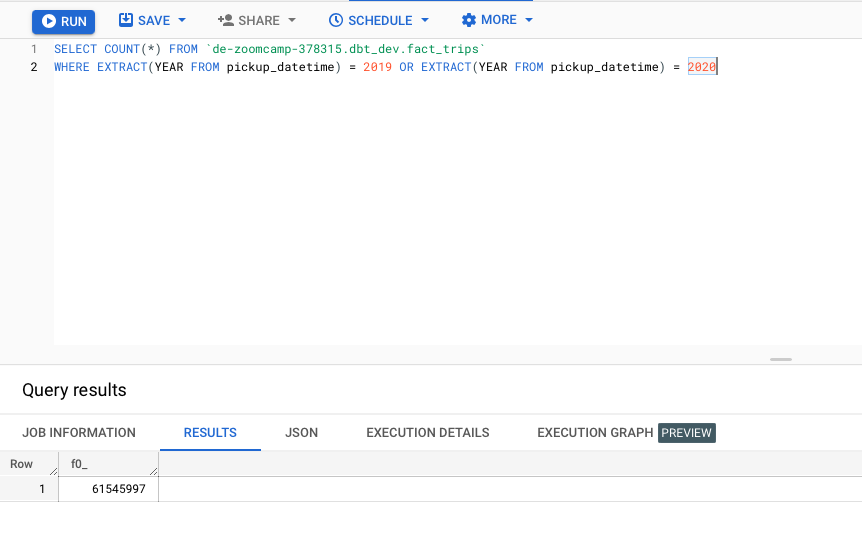
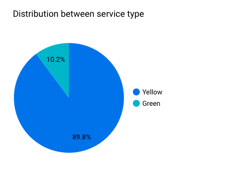
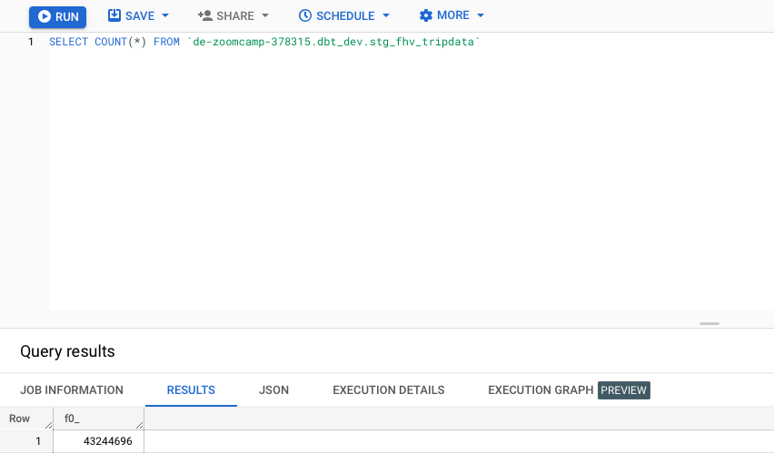
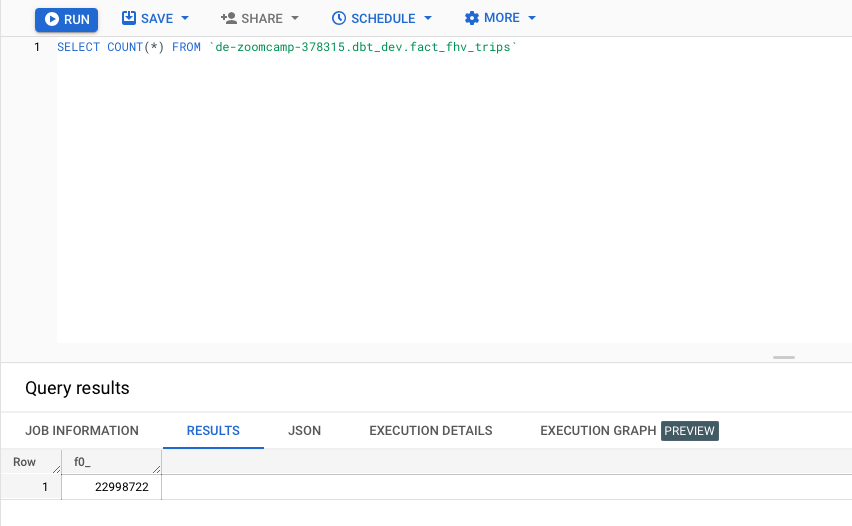
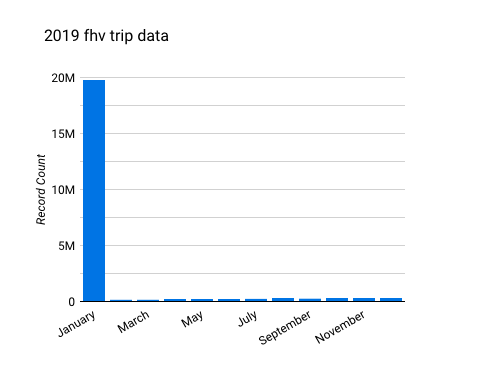

## Week 4 Homework 
source: https://github.com/DataTalksClub/data-engineering-zoomcamp/blob/main/cohorts/2023/week_4_analytics_engineering/homework.md
my code: https://github.com/ulanliu/DE_zoomcamp/tree/main/w4_analytics_engineering/2023_version/models

### Question 1: 

**What is the count of records in the model fact_trips after running all models with the test run variable disabled and filtering for 2019 and 2020 data only (pickup datetime)?** 

- 41648442
- 51648442
- **_61648442_** No number matched, so pick up the closest one
- 71648442

  

### Question 2: 

**What is the distribution between service type filtering by years 2019 and 2020 data as done in the videos?**

- **_89.9/10.1_** No number matched, so pick up the closest one
- 94/6
- 76.3/23.7
- 99.1/0.9

### Question 3: 

**What is the count of records in the model stg_fhv_tripdata after running all models with the test run variable disabled (:false)?**  

- 33244696
- **_43244696_**
- 53244696
- 63244696

### Question 4: 

**What is the count of records in the model fact_fhv_trips after running all dependencies with the test run variable disabled (:false)?**  

- 12998722
- **_22998722_**
- 32998722
- 42998722

### Question 5: 

**What is the month with the biggest amount of rides after building a tile for the fact_fhv_trips table?**

- March
- April
- **_January_**
- December

